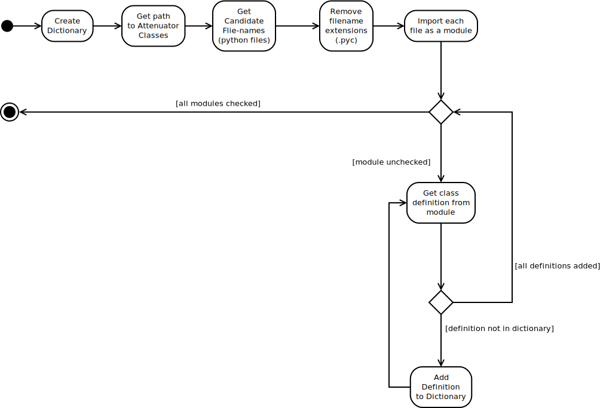

The Attenuator Factory
======================

Contents:

   * :ref:`is_attenuator <attenuators-annenuator-factory-is-attenuator>`
   * :ref:`get_definitions <attenuators-attenuator-factory-get-definitions>`

.. _attenuators-annenuator-factory-is-attenuator:

The `is_attenuator` Function
----------------------------

This function will be passed into the `inspect.getmembers` function. It returns ``True`` whenever the object passed to it is a sub-class of the ``Attenuator`` class. It first checks that the object is a class definition to make sure that it has a `__base__` attribute. I suppose it could also do a hasattr call, but this function came about as part of some empirical testing so there were prior reasons that I can't remember any more as to why I did it this way.

.. '

.. currentmodule:: cameraobscura.attenuators.AttenuatorFactory
.. autosummary::
   :toctree: api

   is_attenuator

.. _attenuators-attenuator-factory-get-definitions:

Get Definitions
---------------

This is a function to build the dictionary of <name>:<class definition> pairs. It has a small hack in it that checks that the ``__name__`` variable doesn't contain '__builtin__' because Pweave doesn't create that variable. Unfortunately that means that I can't print out what it discovers in this documentation. The discovered identifiers are being displayed in the sample configuration file, though, so entering::

    rvr fetch --section attenuation

will dump a sample configuration file with the list of the dictionary's keys in the comments for the `name` option in the configuration file.

.. autosummary::
   :toctree: api

   get_definitions

   `get_definitions` Activity Diagram
   

.. _attenuators-attenuator-factory-class:

The AttenuatorFactory Class
---------------------------

.. currentmodule:: cameraobscura.attenuators.AttenuatorFactory
.. autosummary::
   :toctree: api

   AttenuatorFactory
   AttenuatorFactory.GetAttenuator

.. code::

    <type 'exceptions.SyntaxError'>
    invalid syntax (chunk, line 30)
    

The ``AttenuatorFactory`` imports any class defined in the same directory that it's in if the class is a sub-class of the :ref:Attenuator <attenuators-attenuator-base-class>` base-class. The `GetAttenuator` method is its only method. The `GetAttenuator` method is a class method that maintains a class variable `._attenuators` that is a dictionary of <name>:<Attenuator sub-class instance>.  Note that they are class-attributes, not instance attributes so it's essentially behaving like a module -- you don't need to instantiate it (it doesn't have a constructor defined). A side-effect of this is it has no logging.

.. warning:: This appears to create singletons (for every IP address) so if more than one class uses this they should be aware that they're sharing the same object.

.. '

.. .. csv-table:: Known Attenuators
..   :header: Identifier, Class Name

.. <<name='constants', echo=False, results='sphinx'>>=
.. # backwards compatibility        
.. #KNOWN_ATTENUATORS = ATTENUATORS.keys()
.. #KNOWN_IMPLEMENTATIONS = (AdeptN, AdeptNCustomPath, MockAdeptN, WeinschelP, MockAttenuator)
.. #KNOWN_ATTENUATORS = (implementation.__name__.lower() for implementation in KNOWN_IMPLEMENTATIONS)
.. #ATTENUATORS = dict(zip(KNOWN_ATTENUATORS, KNOWN_IMPLEMENTATIONS))
.. if __name__ == '__builtin__':
..     for name, definition in ATTENUATORS.iteritems():
..         print "   {0},{1}".format(name, definition.__name__)
.. @
