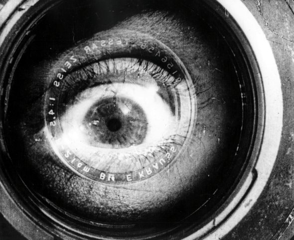

Camera Obscura
==============

Written Documentation
---------------------

This is the more organized documentation written outside of the code.

.. toctree::
   :maxdepth: 1

   User Documentation <documentation/user/index>
   Developer Documentation <documentation/developer/index>

Auto-Generated Documentation
----------------------------

These are the documents created from the source files.

.. toctree::
   :maxdepth: 1

   The Camera Obscura (Read Me) <readme.rst>
   The Log Setter <set_logger.rst>

.. toctree::
   :maxdepth: 1

   Attenuators <attenuators/index.rst>
   Commands <commands/index.rst>
   Common Code <common/index.rst>
   Hosts <hosts/index.rst>
   RVR Plugin <plugins/index.rst>
   Rate-Vs-Range <ratevsrange/index.rst>
   Testing The Modules <tests/index.rst>
   Utility Modules <utilities/index.rst>

