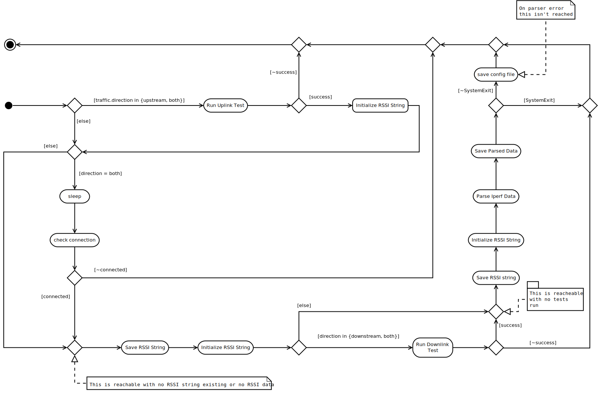
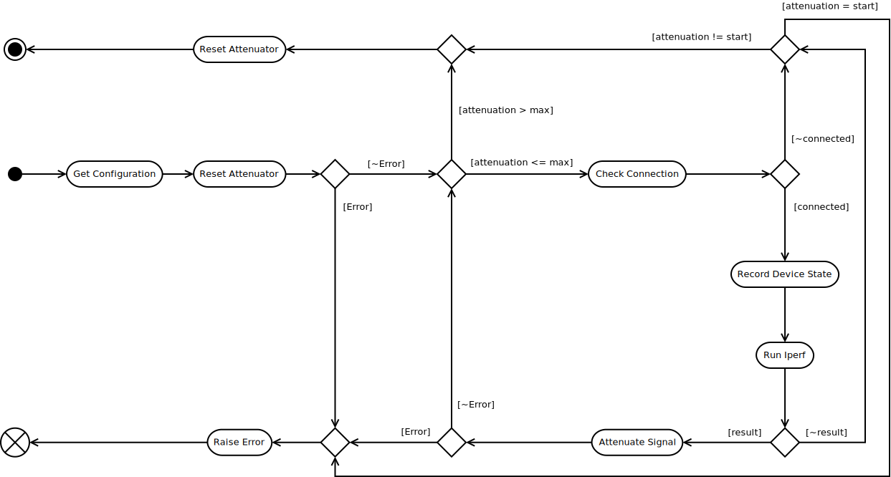

Rate Vs Range Throughput Test
=============================

This is Russell Miller's AutomatedRVR module (just the buggy parts).

.. '

.. code:: python

    class AutomatedRVREnum(object):
        """
        A holder of special constants for the Test method
        """
        __slots__ = ()
        upstream = IperfConstants.up
        downstream = IperfConstants.down
    
        # for the query
        attenuation = 'attenuation'
        dut_upstream = "DUT TX (upstream)"
        server_upstream = "Server RX (upstream)"
        dut_downstream = 'DUT RX (downstream)'
        server_downstream = 'Server TX (downstream)'
    

.. _cameraobscura-automatedrvr-test:

The Test Class
--------------

This class runs the Rate-Vs-Range Test.

API
~~~

.. currentmodule:: cameraobscura.ratevsrange.AutomatedRVR
.. autosummary::
   :toctree: api

   Test

The Attributes
++++++++++++++

.. autosummary::
   :toctree: api

   Test.ping
   Test.attenuations
   Test.maximum_attenuation   
   Test.configuration
   Test.dut
   Test.server
   Test.iperf
   Test.attenuator
   Test.result_location
   Test.dump

The Methods
+++++++++++

.. autosummary::
   :toctree: api
   
   Test.save_configuration
   Test.connected
   Test.get_querier
   Test.__call__
   Test.RunTest   
   Test.reset

Class Diagrams
~~~~~~~~~~~~~~

This is an idealized Diagram.

.. uml::

   Test : __init__(configuration)
   Test: Hosts.HostSSH dut
   Test : Hosts.HostSSH server
   Test : Attenuator attenuator
   Test : logging.Logger logger
   Test: String result_location
   Test : (Boolean, String) __call__()
   Test: (Boolean, String) RunTest(String direction)
   Test o- RVRConfiguration
   Test o- Hosts.HostSSH
   Test o- SerialUtils.Utils
   Test o- GenericUtils.Utils
   Test o- Attenuator.AttenuatorFactory
   Test o- Attenuator.Attenuator
   Test o- RVRConfiguration
   Test o- Query

Responsibilities
~~~~~~~~~~~~~~~~

Right now:

   * Get values from the configuration
   * Build connections to the server and dut
   * Build aggregated objects
   * Get, timestamp, and maintain output folder path
   * Run the Iperf-test
   * Get and save rss values
   * Create and save csv-file from Iperf final values (raw-data is being discarded!)
   * Copies any configuration files it finds
   * Runs pings between client and server to test connectivity
   * Sets Attenuator attentuation
   * Tries to discover if an SSH connection is dead

Collaborators
~~~~~~~~~~~~~

From this package:

   * SimpleClient, TelnetClient
   * TheHost
   * Attenuator.AttenuatorFactory
   * Attenuator.Attenuator
   * query.Query
   * Ping
   * StepIterator

.. _automatedrvr-attenuate-signal:

The attenuate_signal Method
---------------------------

This doesn't do much but call the Attenuator, but since there are so many sub-modules I'm moving it out to make it easier to test.

.. _automated-rvr-test-runtest:

The Call Method
---------------

Not to be confused with ``RunTest`` this is what calls ``RunTest``.

The Original Method
~~~~~~~~~~~~~~~~~~~

   This is the original (more or less) method's activity diagram.

.. '

The Newer Method
~~~~~~~~~~~~~~~~
   
.. figure:: figures/run_test_new.svg
   :align: center

   This is the proposed activity diagram.

.. _automated-rvr-test-underscore-runtest:

The RunTest Method
-------------------

The RunTest Method is the method that actually runs the test (RunTest is mostly sets things up and tears things down).

Paths
~~~~~

This is the proposed main path.

    #. Get Attenuator Configuration

    #. Reset the Attenuator

    #. Run the Test

       #. Check the network connection
       #. Record the DUT state
       #. Run the test (Iperf)
       #. Attenuate the signal
       
    #. Reset the Attenuator

Alternative Path 1 (Attenuator Error)
+++++++++++++++++++++++++++++++++++++

There are four points where the attenuator is called. This is a fatal error which will raise a :ref:`TestsuiteError <cameraobscura-error>`.

   #. Attenuate

   #. Catch `AttenuatorError`

   #. Log error

   #. Raise `TestsuiteError`

Alternative Path 2 (no Iperf result)
++++++++++++++++++++++++++++++++++++

The current `utils.RunIperfTraffic` method doesn't raise errors but instead returns `result` as False (or possibly None). This needs to be changed but for now that's how it is. The original implementation treated this the same as an AttenuatorError, quitting the method, but this causes it to skip the Attenuator reset at the end of the method. The proposed change is to instead break out of the loop and let the cleanup happen. The assumption is that the failure was caused by the attenuation of the signal and not anything inherent in the code.

   #. Run RunIperfTraffic

   #. Check `result` and find it False

   #. Log the event

   #. break out of loop

Alternative Path 3 (No Network Connection)
++++++++++++++++++++++++++++++++++++++++++

The sentinel condition for the While Loop is based on the attenuation setting. There is also a network check (ping) being done (this is optional, but run by default). It was introduced when it was discovered that some devices hang when iperf can't run traffic but still maintains a connection (edge-network conditions). It was made optional when a vendor informed us that they didn't implement (a working) ping on their device. Since this is considered simply the case that the signal has been attenuated beyond what the device(s) can use it is treated as a normal occurrence and simply break out of the loop.

.. warning:: In the original code this was one of the main failure points in the code as the output of `ping` on different devices changed enough that the screen-scraping would fail even though the ping succeeded. The proposed fix is the path that follows this one (Path 4).

   #. Check network connection

   #. Fail to ping successfully

   #. Log the events

   #. break from the loop

Alternative Path 4 (`ping` never succeeds)
++++++++++++++++++++++++++++++++++++++++++

Since the `ping` check has proven so fragile this is meant to make it more obvious where the failure occurred.

  #. Check Network Connection

  #. Fail to ping successfully

  #. Log the event

  #. Compare current attenuation and start attenuation

  #. If current = start log error and raise CameraobscuraError

A Newer Model
-------------

The previous figure was based on an initial simplification of the original code. On looking at it I realized that it didn't necessarily make sense to reset the attenuator before and after the loop, so I simplified it once more.

.. '

.. figure:: figures/run_test_activity_diagram_2.svg
   :align: center

