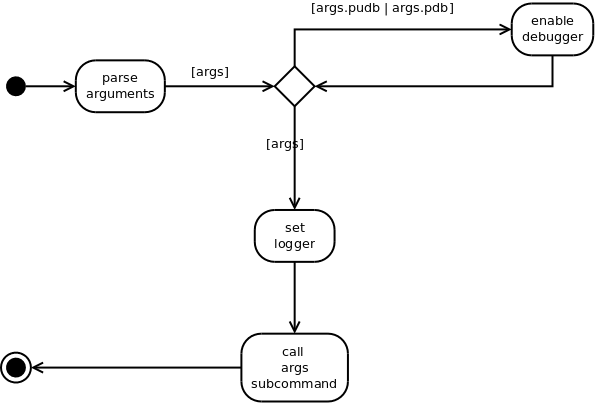

The Main Entrance
=================

.. _rate-vs-range-main:

This is the main entrance point for running this (RVR) code without an external code-runner.

.. currentmodule:: cameraobscura.ratevsrange.main
.. autosummary::
   :toctree: api

   parse_args

Parse Arguments
---------------

.. code:: python

    class ArgumentConstants(object):
        """
        Constants (primarily used to keep the tests in sync)
        """
        __slots__ = ()
        version = '2014.12.19'
        # defaults
        default_configuration = 'rvr_configuration.ini'
        default_path = 'AutomatedRVR'
    

The `parse_arguments` function creates an ArgumentParser, adds the arguments and sub-commands and parses the command line (or arguments list if it was passed in as an argument).

.. image:: figures/parse_arguments_activity.*

Enable Debugging
----------------

Checks the `args` namespace to see if the user asked for an interactive debugger and enables it (if possible).

.. image:: figures/enable_debugging_activity.*

The Sub-Strategies
------------------

These are functions that the sub-parsers use to chose the path to follow at run-time based on the user's command-line arguments. The get_examples was created so that other code can get them.
.. '

.. autosummary::
   :toctree: api

   get_examples
   fetch_configuration
   run_configuration

The Main Function
-----------------

The main entry point to run the rate-vs-range code:

   #. Get `args` namespace from ``parse_args``

   #. If `args.pudb` or `args.pdb`, enable debugging

   #. Set the logger

   #. Call the subcommand

