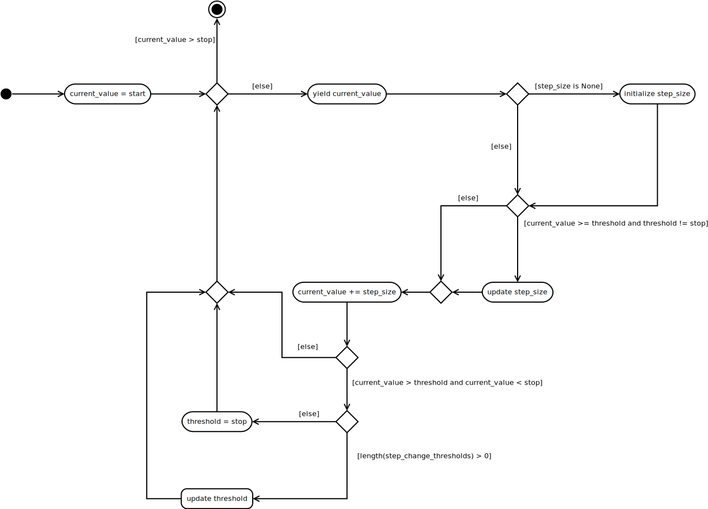

The Step Iterator
=================

.. _step_iterator:

This is a module to provide an iterator for attenuation steps. There was at one time a request to be able to change the size of the attenuation steps based on a threshold value (i.e. when the attenuation exceeds the threshold, increase the amount added to the attenuation on each execution of the loop). Looking at the configuration files being out in the wild it looks like this 'feature' isn't actively used, but since it was implemented this module is created to provide a more explicit implementation (as well as some documentation).

.. '

Use Cases
---------

.. uml::

   User -> (Requests only one step size)
   User -> (Requests two step-sizes and one change in step)
   User -> (Requests more than two step sizes)
   User -> (Requests a list of steps)
   User -> (Requests attenuations in both directions)

The StepBase Class
------------------

In order to support the request from Brad to be able to specify values for the attenuations (as opposed to just the parameters making up a range of values) I'm  making a ``StepList`` class. Since there's a certain amount of overlap between the the two types of step-iterators, the ``StepBase`` will hold the common attributes.

.. module:: cameraobscura.ratevsrange.stepiterator
.. autosummary::
   :toctree: api

   StepBase   

The StepList Class
------------------

The ``StepList`` was created to address a request to allow the users to run a second test with specified attenuation values rather than a range of values. Although a little arithmetic on the user's part would achieve the same thing, why force them to think?

.. '

.. uml::

   StepBase <|-- StepList

.. currentmodule:: cameraobscura.ratevsrange.stepiterator
.. autosummary::
   :toctree: api

   StepList

The StepRange Class
-------------------

.. currentmodule:: cameraobscura.ratevsrange.stepiterator
.. autosummary::
   :toctree: api

   StepRange
   StepRange.threshold
   StepRange.step_size
   StepRange.step_sizes
   StepRange.update_threshold
   StepRange.__iter__
   StepRange.check_rep
   StepRange.reversible
   StepRange.direction
   StepRange.list_direction
   StepRange.compare
   StepRange.threshold_compare
   StepRange.increment_index
   StepRange.reverse

.. uml::

   StepBase <|-- StepRange
   StepRange : Integer start
   StepRange : Integer stop
   StepRange : List step_sizes
   StepRange : List step_change_thresholds
   StepRange : Integer current_value
   StepRange : Integer step_size
   StepRange : Integer threshold
   StepRange : reverse()
   StepRange : __iter__()
   

The Constructor Parameters
--------------------------

These are what should (or can be) passed in on constuction of the `StepRange`.

start
~~~~~

This is the value that the iterator will start with (the first value that it will yield).

stop
~~~~

This is the end-limit of the values that will be generated. It isn't necessarily the largest (or smallest) value since the step-sizes can be greater than 1, but the generator will stop anytime the next value would be greater than ``stop`` (if ascending, less than ``stop`` if descending, meaning start is greater than stop).

.. note:: To match the behavior of the older code the stop-value is inclusive, rather than stopping prior to it in every case the way other python functions like `range` work.

.. '

step_sizes
~~~~~~~~~~

This is a list of step-sizes in the order that they are to be used.

    * This list should always exceed the number of step_thresholds by 1.
    * The StepRange is using indexing to get the sizes so it has to be a list or something that acts like a list.
    * Since changes of direction are allowed they will be cast to positive integers (so the magnitude is all that counts)

step_thresholds
~~~~~~~~~~~~~~~

A list of thresholds which when exceeded (:math:`currentValue > threshold`) will cause the current step-size to be changed to the next item in the ``step_sizes`` list. If no change in step-size is required, it should be set to ``None`` (the default).

reversal_limit
~~~~~~~~~~~~~~

This is the number of times to allow the iteration to change directions. The intention is to allow the user to attenuate out until it kills the connection, then attenuate back in. If the ``reversal_limit`` is 0 (the default) then no reversals will be allowed, meaning that when ``reverse()`` is called, the current-value will be set to the stop-value so the generator will stop.

The Attributes
--------------

current_value
~~~~~~~~~~~~~

The `current_value` attribute is a variable to hold the current value in the iteration. It is initialized with the `start` value and incremented with the `step_size` attribute with each iteration. This is what is being generated by the `__iter__` method.

threshold
~~~~~~~~~

This is the current threshold to check if the step-size needs to be changed. If the `current_value` exceeds the ``threshold`` then the ``step_size`` and ``threshold`` are both be updated, if there are more of them.

step_size
~~~~~~~~~

The `step_size` is the amount to increase the `current_value` with each iteration. If the `current_value` exceeds the `threshold` then the step-size should be increased to the next step-size (if there is one).

reversals
~~~~~~~~~

This is a count of how many times the direction has been reversed (by calling the ``reverse`` method).

direction
~~~~~~~~~

This is the direction that the values are going. If they are increasing then it is 1, if they are decreasing it is -1.

list_direction
~~~~~~~~~~~~~~

This is the direction to traverse the ``step_sizes`` and ``step_change_thresholds`` lists. It reverses its sign whenever ``reverse`` is called.

compare
~~~~~~~

This is the comparison done between the current value and the stop value to decide whether to stop or not. If the values are increasing, then it is :math:`\leq` (i.e. :math:`\textit{while current} \leq stop`) and if the values are decreasing then it is :math:`\geq`.

threshold_compare
~~~~~~~~~~~~~~~~~

This is the comparison done between the current value and the threshold to see if the step-size should be changed. When the values are increasing, it is :math` \geq ` (i.e. :math:`\textit{if current value} \geq threshold`) and when the values are decreasing it is :math:`\leq`.

reversible
~~~~~~~~~~

This is true if the ``reversals`` haven't reached the ``reversal_limit``.

.. '

The Methods
-----------

update_threshold
~~~~~~~~~~~~~~~~

This method was introduced because updating the step-size requires checking the threshold, so a separate method was required to control updating the threshold (if the update was made in the `threshold` property itself then checking it would always update it before the conditional was checked so it would never be exceeded). Specifically::

    if self.current_value > self.threshold:
        <do something>

Would never become True because self.threshold would update itself because it detected it was greater than the current value. Anyway, it was needed.

increment_index
~~~~~~~~~~~~~~~

This takes a list index (e.g. ``current_step_index``) and the list that it is for (e.g. ``step_sizes``) and 'increments' it. It actually decrements it if the values are going down. Additionally it bounds it on the upper side by the highest index in the list and on the lower side by 0. The index variable isn't changed in place, instead it's given as a returned value.

reverse
~~~~~~~

This changes the direction of the iteration. If ``reversible`` is False, it sets the ``current_value`` to the ``stop`` value, otherwise it increments ``reversals``, swaps the start and stop values, resets ``threshold`` and increments the list-indices.

__iter__
~~~~~~~~

The iterator is the main (really the only) way to use this class. it's expected that it will be used something like:

.. '

.. code::

   for value in step_iterator:
       do_something()

Activity Diagram
----------------

check_rep
~~~~~~~~~

This method checks the integrity of the parameters.

    * Is the stop value greater than or equal to the stop value?

StepIterator Class
------------------

.. uml::

   StepIterator o- StepList
   StepIterator o- StepRange

.. code:: python

    class StepIterator(object):
        """
        An aggregator of step-iterators
        """
        def __init__(self, step_list=None,
                     *args, **kwargs):
            """
            StepIterator constructor
    
            :param:
    
             - ``step_list``: collection of steps
             - ``reversal_limit``: number of reversals allowed
            """
            self.args = args
            self.kwargs = kwargs
            self.step_list = step_list
            self._iterator = None
            return
    
        @property
        def iterator(self):
            """
            StepRange if step_list not set
            """
            if self._iterator is None:
                if self.step_list is not None:
                    if 'reversal_limit' in self.kwargs:
                        reversal_limit = self.kwargs['reversal_limit']
                    else:
                        reversal_limit = 0
                    self._iterator = StepList(step_list=self.step_list,
                                              reversal_limit=reversal_limit)
                else:
                    self._iterator = StepRange(*self.args, **self.kwargs)
            return self._iterator
    
        def __iter__(self):
            """
            traverses the iterator
    
            :yield: next step
            """
            for step in self.iterator:
                yield step
            return
    
        def __getattr__(self, name):
            """
            A pass-through to the iterator
            """
            return getattr(self.iterator, name)

