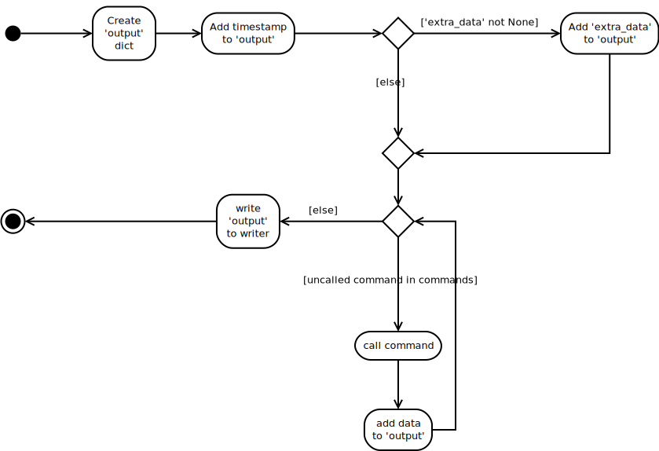

The Query
=========

To accomodate the almost arbitrary ways to get device-state information from a DUT, a general `Query` class is created to let user's specify commands to send and expressions to extract information from their output.

.. '

The Query Class
---------------

.. _query-class-responsibilities:

Responsibilities
----------------

   #. Maintains list of `fields` to use as headers for the files
   #. Maintains `commands` to send to the device 
   #. Maintains `expressions` (regular) to parse the output
   #. Maintains a csv-writer so save the output
   #. Maintains a connection to the device
   #. Traverses the fields, sending commands, checking output, and writing the results to the csv-writer
   
.. _query-class-collaborators:

Collaborators
-------------

    * csv.DictWriter
    * paramiko.SSHClient (or equivalent)

.. currentmodule:: csv
.. autosummary::
   :toctree: api

   csv.writer
   csv.DictWriter

.. currentmodule:: paramiko
.. autosummary::
   :toctree: api

   SSHClient

.. _query-class-path:

Main Path
---------

    1. Check if csv-output has been opened.
       1.1. Open csv-output if not opened
       1.2. Write header if output just opened
    2. Traverse fields
       2.1. Send field's command to connection
       2.2. traverse lines of output from connection
          2.2.1. check if field's expression matches line and add match to output-dictionary if it does
          2.2.2. If no match, continue to next line
       2.2. If no match made, add not-available token to output-dictionary
   3. Send output-dictionary to csv-output

   Activity Diagram for Query call

.. _query-class-implementation:

The Query Class
---------------

.. uml::

   Query : File output_file
   Query : SSHClient connection   
   Query : List fields
   Query : Dict commands
   Query : Dict expressions
   Query : DictWriter writer
   Query : String not_available
   Query : __call__()
   Query o- csv.DictWriter
   Query o- client
   Query o- TheCommand

.. currentmodule:: cameraobscura.utilities.query
.. autosummary::
   :toctree: api

   Query
   Query.output_file
   Query.expressions
   Query.writer
   Query.close
   Query.__call__
   Query.check_rep
   Query.__del__

The Call
--------

The call builds a dictionary of data output from the Query's commands. It always starts with a timestamp, then adds any 'extra_data' that was passed in to the call before calling each command. After calling each command once it writes the output as a row in the (csv) output-file.

.. '

.. code:: python

    class QueryEnum(object):
        __slots__ = ()
        section = 'query'
    
        # special options
        delimiter = 'delimiter'
        not_available = 'not_available'
        filename = 'filename'
        timeout = 'timeout'
        trap_errors = 'trap_errors'
    
        # reserved names
        reserved = (delimiter, not_available, filename, timeout,
                    trap_errors)
    
        # defaults
        default_delimiter = ','
        default_not_available = 'NA'
        default_filename = 'query.csv'
        default_timeout = 10
        default_trap_errors = True
    

.. _query-configuration:

The QueryConfiguration
----------------------

.. uml::

   BaseConfiguration <|-- QueryConfiguration
   QueryConfiguration : String delimiter
   QueryConfiguration : List fields
   QueryConfiguration : List commands
   
.. currentmodule:: cameraobscura.utilities.query
.. autosummary::
   :toctree: api

   QueryConfiguration
   QueryConfiguration.delimiter
   QueryConfiguration.not_available
   QueryConfiguration.fields
   QueryConfiguration.commands
   QueryConfiguration.expressions
   QueryConfiguration.filename

Example Configuration::

   [query]
   delimiter = ;
   not_available = nunya
   rssi = iwconfig wlan2; Signal\slevel=(-\d+\s+dBm)

.. csv-table:: QueryConfiguration defaults
   :header: value, default
   :delim: ;

   delimiter;,
   not_available; NA
   filename; query.csv
   

The Example configuration:

.. code::

    
    #[query]
    # these are arbitrary commands that will be called in between attenuations
    # it's original use-case is to get RSSI and other monitoring information
    # but since it's free-form you can pass in whatever you like
    # the commands are issued on the DUT, not the traffic-server
    
    # delimiter separating command and expression
    # this is provided so that if the command or expression has a comma in it
    # you can use an alternative
    
    #delimiter =  ,
    
    # if you want to specify a filename set the filename option
    # filename = query.csv
    
    # to change the readline timeout
    # timeout = 10
    
    # to have it crash instead of trap socket errors
    # trap_errors = trap_errors
    
    # everything else is of the format:
    # <column-header> = <command><delimiter><regular expression>
    # the column-header will be used in the csv-file
    # the regular expression has to have a group '()' or it will raise an error
    # the contents of the group is what will be saved to the file
    
    #some examples:
    #rssi = iwconfig wlan0,Signal\slevel=(-\d+\sdBm)
    #noise = wl noise, (.*)
    #bitrate = iwconfig wlan0, Bit\sRate=(\d+\.*\d*\sMb/s)
    #counters = wl counters, (rxcrsglitch [0-9]* )
    #rtt_min/rtt_avg/rtt_max/rtt_mdev = ping -c 2 192.168.103.17,rtt\s+min.*=\s*(.*)\s+ms
    
    

The Query Builder
-----------------

This is a first builder. The intent is that for each high-level component there will be a `Class - Configuration - Builder` troika. The configurations are already in place for most cases but the AutomatedRVR is this huge class, at least in part because it is acting as a builder of its parts as well as an executor of its test. As with the configurations it would be better to have an RVRBuilder (or some sensibly-named thing) and each part would have its own builder. This might not alway seem to be necessary, but in the case of things like TheCommand or TheQuery where they are expecting a connection to a remote device, it seems like there'd be too much redundant code to specify the connections every time. The Builder thus acts to defer the building of the components until the master-builder has built the connection. Each builder should know how to build its object, but defer to another builder if it needs something that is not unique to it.

    * Configurations map config-files to parameters needed to build a component
    * Builders map configurations and built-objects to built components

.. '

.. uml::

   QueryBuilder : TheQuery product
   QueryBuilder : TheHost connection
   QueryBuilder : QueryConfiguration configuration
    
.. autosummary::
   :toctree: api

   QueryBuilder
   QueryBuilder.product

